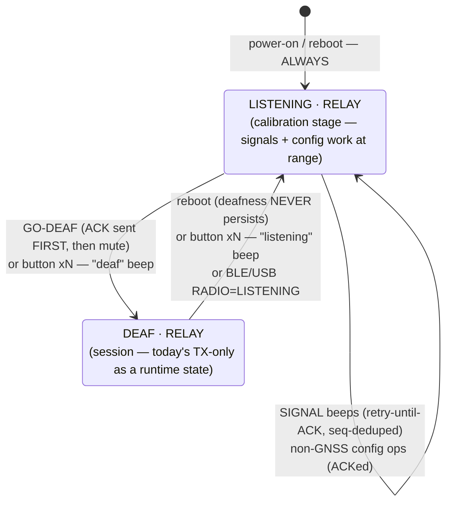
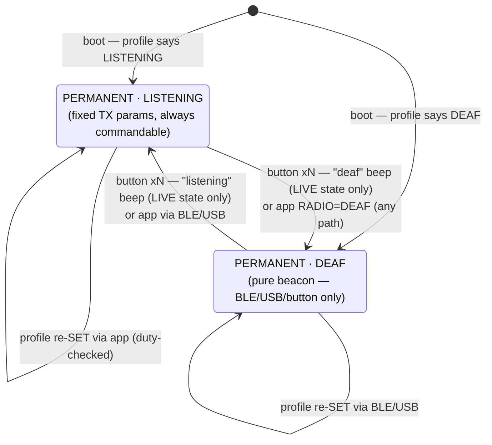

# Radio states & profiles — state machines (A4 design, agreed 2026-07-26)

> **Status: DESIGN LOCKED, not yet implemented.** This encodes the owner-agreed A4 model
> (see `../TODO.md` §A4) as the reference state machines for the A1+A4 implementation
> round. When it ships, the transition tables graduate into `DOWNLINK.md` (the wire
> contract) and this file becomes the behavioral reference. Terms:
> **LISTENING** = LoRa RX enabled between transmissions (portnum-260 commands work at
> range); **DEAF** = runtime TX-only (radio sleeps between TX; LoRa-unreachable; BLE/USB
> command path still works). The button toggle and reboot are the two recovery paths that
> depend on nothing.

## 1. GPS/LoRa tag — HYBRID profile (default; the AutoShot choreography)

```mermaid
stateDiagram-v2
    state "LISTENING · ADAPTIVE<br/>(speed-gated TX, commands work at range)" as LA
    state "LISTENING · CALIBRATION<br/>(max-rate TX, TTL dead-man armed)" as LC
    state "DEAF · SESSION<br/>(adaptive TX, radio sleeps between TX)" as DS

    [*] --> LA : power-on / reboot — ALWAYS

    LA --> LC : MODE=CALIBRATION (ACKed, TTL armed)
    LC --> LC : TTL refresh (ACKed)<br/>SIGNAL beeps (retry-until-ACK, seq-deduped)
    LC --> LA : TTL expires (dead-man)<br/>or MODE=ADAPTIVE (ACKed)
    LC --> DS : GO-DEAF (ACK sent FIRST, then mute;<br/>TX drops to adaptive)
    LA --> DS : GO-DEAF (ACK first, then mute)<br/>or button xN — "deaf" beep
    DS --> LA : reboot (deafness NEVER persists)<br/>or button xN — "listening" beep<br/>or BLE/USB RADIO=LISTENING
```



Notes: the adaptive fast/idle tiers live INSIDE both `ADAPTIVE` states (unchanged speed
gate); the simulator and TRACK ops require LISTENING when driven over LoRa, but remain
available over BLE/USB in any state (phone path bypasses the radio).

## 2. BLE5/LoRa bridge tag — HYBRID profile

Same skeleton, no GNSS modes: the bridge relays Dronetag novelty at its configured spacing
in every state; the calibration stage only means it can HEAR (signals, config, go-deaf).



## 3. Both flavors — PERMANENT profile (explicit app consent)

Fixed TX parameters (e.g. adaptive fallback disabled) AND a fixed radio state, persisted.
Duty legality is enforced when the profile is SET (illegal sustained rates rejected for
the configured region). No TTLs, no choreography.



**Proposed rule (needs owner confirmation):** in PERMANENT, the button toggles the LIVE
radio state only — it never rewrites the persisted profile, so a reboot restores the
configured state. Rationale: the button is a maintenance/recovery hatch; a deployed
beacon that someone pockets and pokes should come back as configured. Profile changes
remain an explicit app action.

## 4. Session-start choreography — guaranteed delivery (sequence)

At-least-once delivery, exactly-once playback: the sender retransmits the SAME seq until
the correlated ACK arrives; the tag ACKs duplicate seq without replaying, so retries can
never double-beep. Every step is confirmed before the next; the one forbidden outcome is
the operator believing a beep happened when it did not.

```mermaid
sequenceDiagram
    participant A as AutoShot / MeshTracker
    participant B as Base (fast-lane, ~0.3 s leg)
    participant T as Tag (LISTENING · CALIBRATION)

    A->>B: SIGNAL record-start (seq=N)
    B->>T: LoRa downlink
    T->>T: long high beep + flash (first delivery of seq=N)
    T-->>B: ACK {op, pattern, seq=N} — correlated
    B-->>A: ACK relayed

    alt ACK lost or delayed
        A->>B: re-send SIGNAL, SAME seq=N (bounded retries, ~0.3 s apart)
        B->>T: LoRa downlink
        Note over T: duplicate seq=N → ACK again, NO replay
        T-->>B: ACK {op, pattern, seq=N}
        B-->>A: ACK relayed
    end

    Note over A: retry budget exhausted → LOUD alert:<br/>"tag did not confirm the signal" — never silent

    A->>B: RADIO=DEAF (retry-until-ACK, same discipline)
    B->>T: LoRa downlink
    T-->>B: ACK — sent BEFORE muting
    B-->>A: ACK relayed
    T->>T: radio muted — DEAF · SESSION begins
    Note over T: stream continues; payload v5 status byte<br/>reports DEAF + HYBRID for app visibility
```

## 5. Transition/ACK reference table

| Trigger | Wire | ACK / confirmation | Beep |
|---|---|---|---|
| MODE=CALIBRATION / ADAPTIVE | 260 op 0x02 | correlated ACK + stream flags echo | — |
| SIGNAL (beep/flash) | 260 op 0x03 | **retry-until-ACK** (echo op+pattern+seq); dedupe = no double-beep | the signal itself |
| GO-DEAF / RADIO state | 260 new op | **retry-until-ACK**; ACK always precedes mute | — |
| Button xN toggle | local | payload v5 status byte on next packets | distinct "deaf" / "listening" signatures (owner-approved vocabulary) |
| Reboot | — | boots per profile (HYBRID → LISTENING·ADAPTIVE) | boot behavior unchanged |
| Profile SET | settings v4 | ACK + persisted; duty-checked at SET | — |

## 6. Open micro-decisions

- **N (button press count)** for the toggle — must not collide with stock Meshtastic
  button actions on the T1000-E; candidate: triple-press. Decide during A1+A4
  implementation after auditing the stock button handler.
- **Button semantics in PERMANENT** — proposed LIVE-only above; confirm or make it
  rewrite the profile.
- Exact beep signatures for the two toggle directions (distinct from the frozen
  language-v2 vocabulary: 1–8 counted, 10 record-start, 11 problem, 0 cancel).
