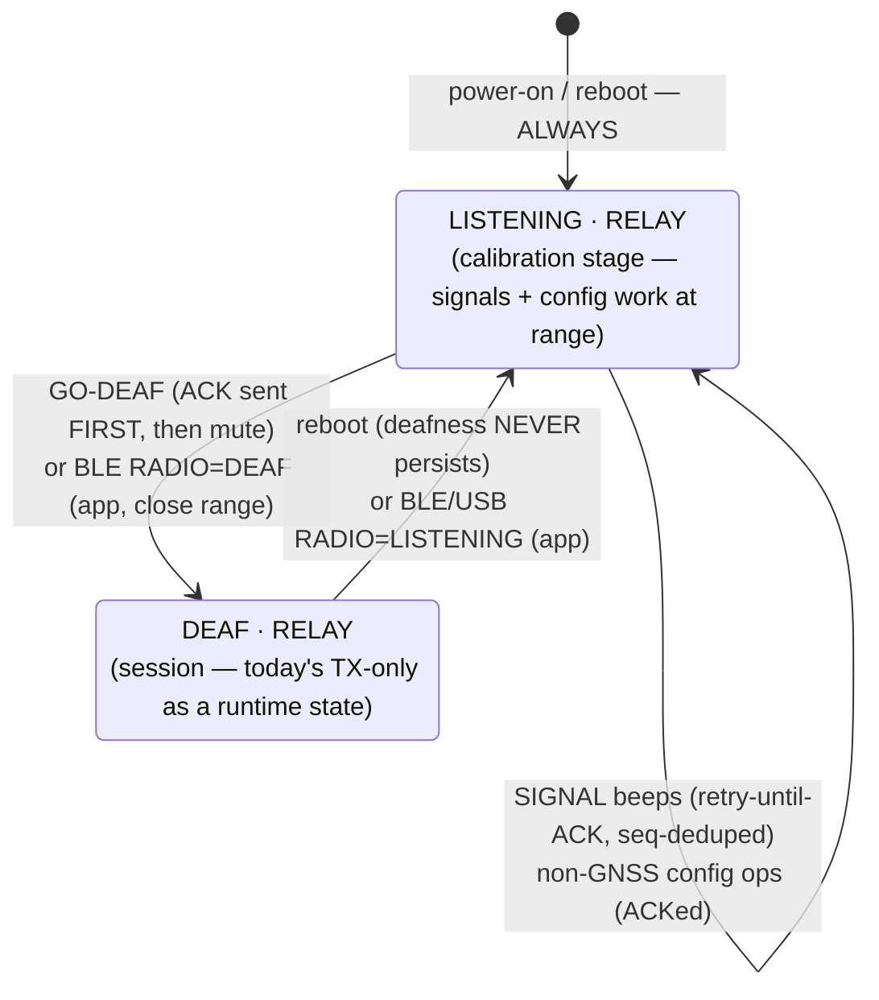
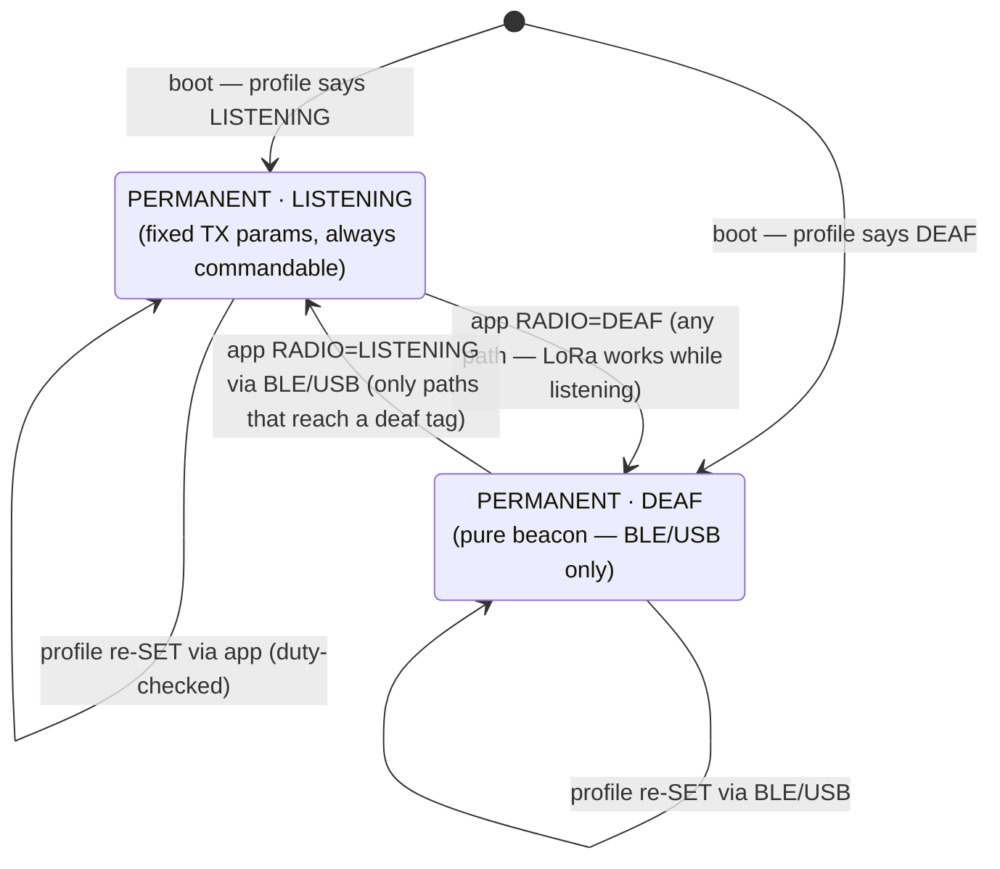
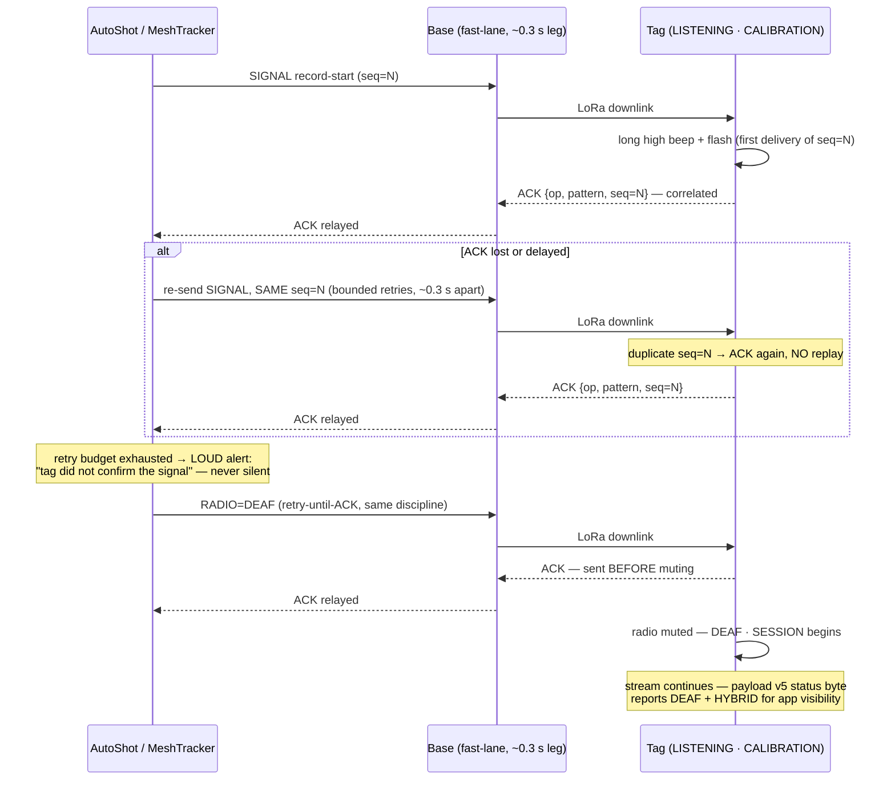

# Radio states & profiles — state machines (A4 design, agreed 2026-07-26)

> **Status: DESIGN LOCKED, not yet implemented.** This encodes the owner-agreed A4 model
> (see `../TODO.md` §A4) as the reference state machines for the A1+A4 implementation
> round. When it ships, the transition tables graduate into `DOWNLINK.md` (the wire
> contract) and this file becomes the behavioral reference. Terms:
> **LISTENING** = LoRa RX enabled between transmissions (portnum-260 commands work at
> range); **DEAF** = runtime TX-only (radio sleeps between TX; LoRa-unreachable; BLE/USB
> command path still works). Reboot is the recovery path that depends on nothing
> (HYBRID never persists deafness).
>
> **One generic machine (agreed 2026-07-26):** the radio-state machinery is a SINGLE
> shared firmware module compiled into both tag flavors — states + persistence rules,
> the radio-state op with ACK-before-mute, the retry-until-ACK signal discipline, and
> the BLE/USB command path that works in every state. Flavors differ only in what runs INSIDE the states (GPS tag: GNSS knobs +
> ADAPTIVE/CALIBRATION TX modes; bridge: relay + sniffer/advertising coexistence).
> Diagram 2 is diagram 1 minus the GNSS-specific state — same machine, fewer rooms.
> Close-range control: the phone toggles LISTENING↔DEAF over BLE in ANY state, on both
> flavors — the bridge gains this via always-on slow connectable advertising (~1–2 s
> interval, ≲0.3 % scan-time cost, Dronetag's ~5 Hz re-adverts cover the gaps; bench A/B
> of sniffer throughput with advertising on/off is the acceptance gate). Recovery ladder,
> both flavors: LoRa (listening) → BLE (close range, any state) → reboot. There is NO
> button toggle (removed 2026-07-26 to simplify): mode control is exclusively the iOS app.

## 1. GPS/LoRa tag — HYBRID profile (default; the AutoShot choreography)

**In plain words:** you power the tag on and it is always reachable — it listens for
commands and streams positions at the smart adaptive rate. When AutoShot starts
calibrating, it switches the tag to full speed and drives the beeps; if the app ever
crashes or walks away, the TTL timer quietly puts the tag back to normal on its own.
When the session actually starts, the app tells the tag "go quiet": the tag confirms
FIRST, then shuts its receiver — from now on it only transmits, saving battery and never
hesitating before a packet. Nothing about that quiet state survives a restart: turn it
off and on and you always get the reachable, adaptive tag back — or bring the phone next
to it and flip it over Bluetooth from the app.

Notes: the adaptive fast/idle tiers live INSIDE both `ADAPTIVE` states (unchanged speed
gate); the simulator and TRACK ops require LISTENING when driven over LoRa, but remain
available over BLE/USB in any state (phone path bypasses the radio).

## 2. BLE5/LoRa bridge tag — HYBRID profile

Same skeleton, no GNSS modes: the bridge relays Dronetag novelty at its configured spacing
in every state — the calibration stage only means it can HEAR (signals, config, go-deaf).

**In plain words:** the bridge never stops doing its one job — repeating the Dronetag's
positions over LoRa. The only thing that changes is whether it can hear you: after
power-on it listens (so it can beep during calibration and take configuration at range),
and when the session starts it goes quiet exactly like the GPS tag — transmit-only, best
battery, deaf to radio commands until a restart or a phone standing right next to it.

## 3. Both flavors — PERMANENT profile (explicit app consent)

Fixed TX parameters (e.g. adaptive fallback disabled) AND a fixed radio state, persisted.
Duty legality is enforced when the profile is SET (illegal sustained rates rejected for
the configured region). No TTLs, no choreography.

**In plain words:** you decide once, in the app, exactly how this tag behaves — for
example "always transmit at 2 Hz, never slow down, never listen" — and it behaves that
way every single time it powers on, forever, until you deliberately change the profile.
The app refuses any combination that would be illegal on your radio band, and it tells
you clearly what you are signing up for: a permanently quiet tag can only be reached by
a phone next to it or a cable — the app is the single place its behavior ever changes.

## 4. Session-start choreography — guaranteed delivery (sequence)

At-least-once delivery, exactly-once playback: the sender retransmits the SAME seq until
the correlated ACK arrives; the tag ACKs duplicate seq without replaying, so retries can
never double-beep. Every step is confirmed before the next; the one forbidden outcome is
the operator believing a beep happened when it did not.

**In plain words:** when the app sends "beep now", it keeps sending that exact same beep
request until the tag answers "played it". If a radio packet gets lost in either
direction, the retry fixes it — and because the tag remembers the request number, hearing
the same request twice never produces two beeps. Only after the record-start beep is
confirmed does the app send "go quiet", which the tag also confirms before actually going
quiet. If the tag never answers, the app makes that failure impossible to miss — you will
never be left believing a beep happened when it did not.

## 5. Transition/ACK reference table

| Trigger | Wire | ACK / confirmation | Beep |
|---|---|---|---|
| MODE=CALIBRATION / ADAPTIVE | 260 op 0x02 | correlated ACK + stream flags echo | — |
| SIGNAL (beep/flash) | 260 op 0x03 | **retry-until-ACK** (echo op+pattern+seq); dedupe = no double-beep | the signal itself |
| GO-DEAF / RADIO state | 260 new op | **retry-until-ACK**; ACK always precedes mute | — |
| Reboot | — | boots per profile (HYBRID → LISTENING·ADAPTIVE) | boot behavior unchanged |
| Profile SET | settings v4 | ACK + persisted; duty-checked at SET | — |

## 6. Open micro-decisions

None — all closed. The button ×N toggle (and its beep signatures and PERMANENT semantics)
was REMOVED on 2026-07-26 to simplify: radio-state control is exclusively the iOS app
(LoRa while listening, BLE at close range in any state), with reboot as the
dependency-free recovery in HYBRID. Consequence accepted: a PERMANENT·DEAF tag is
reachable only via BLE/USB — the app states this at profile-set time.
