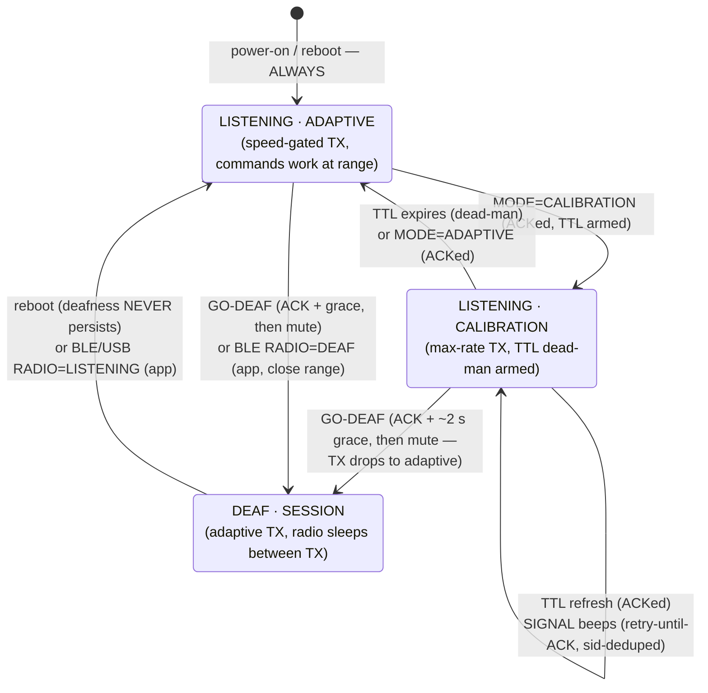
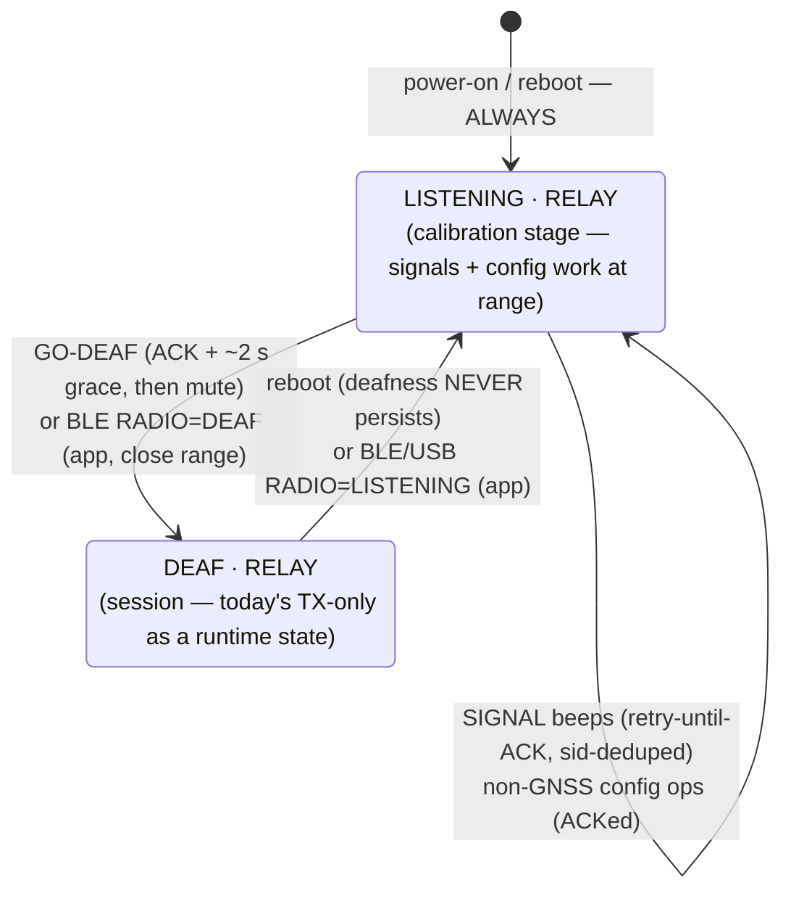
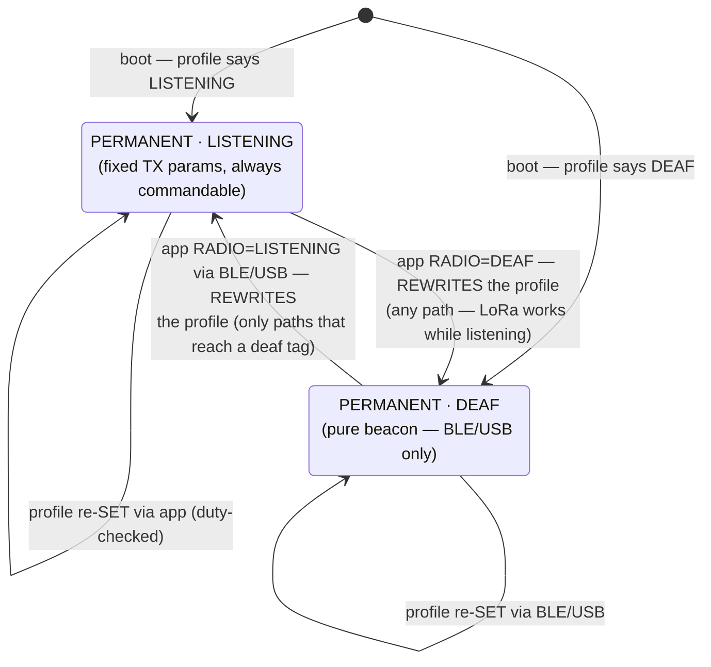
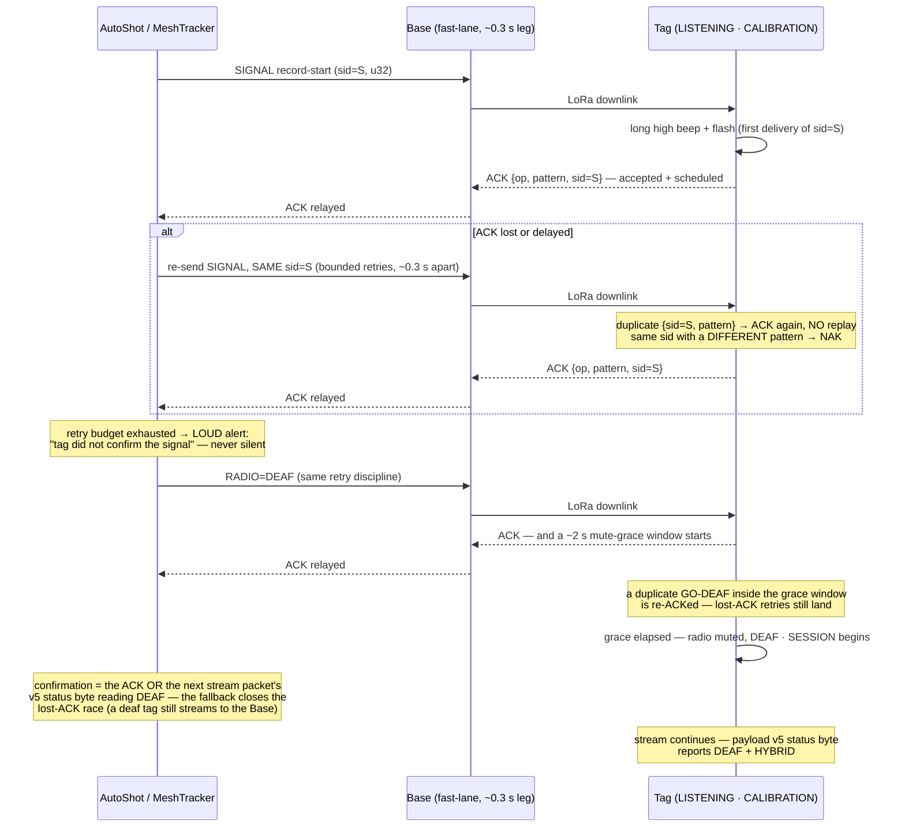

# Radio states & profiles — state machines (A4 design, agreed 2026-07-26)

> **Status: IMPLEMENTED + HARDWARE-VERIFIED (A1+A4 round, 2026-07-26).** The transition
> tables graduated into `DOWNLINK.md` (the wire contract: RADIO op 0x06, SIGNAL v5 sid,
> settings v4, payload v5); this file is the behavioral reference. Bench evidence:
> `tools/bench/verify_fixes.py` C1–C5 (GO-DEAF grace + stream fallback, REAL LoRa deafness,
> PERMANENT reboot persistence, EU duty-floor round-trip) and `verify_bridge.py`. Terms:
> **LISTENING** = LoRa RX enabled between transmissions (portnum-260 commands work at
> range); **DEAF** = runtime TX-only (radio sleeps between TX; LoRa-unreachable; BLE/USB
> command path still works). Reboot is the recovery path that depends on nothing
> (HYBRID never persists deafness).
>
> **One generic machine (agreed 2026-07-26):** the radio-state machinery is a SINGLE
> shared firmware module compiled into both tag flavors — states + persistence rules,
> the radio-state op with ACK-before-mute, the retry-until-ACK signal discipline, and
> the BLE/USB command path that works in every state. Flavors differ only in what runs INSIDE the states (GPS tag: GNSS knobs +
> ADAPTIVE/CALIBRATION TX modes; bridge: relay + sniffer/advertising coexistence).
> Diagram 2 is diagram 1 minus the GNSS-specific state — same machine, fewer rooms.
> Close-range control: the phone toggles LISTENING↔DEAF over BLE in ANY state, on both
> flavors — the bridge gains this via always-on slow connectable advertising (~1–2 s
> interval, ≲0.3 % scan-time cost, Dronetag's ~5 Hz re-adverts cover the gaps; bench A/B
> of sniffer throughput with advertising on/off is the acceptance gate). Recovery ladder,
> both flavors: LoRa (listening) → BLE (close range, any state) → reboot. There is NO
> button toggle (removed 2026-07-26 to simplify): mode control is exclusively the iOS app.

## 1. GPS/LoRa tag — HYBRID profile (default; the AutoShot choreography)

**In plain words:** you power the tag on and it is always reachable — it listens for
commands and streams positions at the smart adaptive rate. When AutoShot starts
calibrating, it switches the tag to full speed and drives the beeps; if the app ever
crashes or walks away, the TTL timer quietly puts the tag back to normal on its own.
When the session actually starts, the app tells the tag "go quiet": the tag confirms
FIRST (and briefly keeps listening so a lost confirmation can be retried), then shuts
its receiver — from now on it only transmits, saving battery and never getting stuck
waiting out someone else's packet. Nothing about that quiet state survives a restart: turn it
off and on and you always get the reachable, adaptive tag back — or bring the phone next
to it and flip it over Bluetooth from the app.

Notes: the adaptive fast/idle tiers live INSIDE both `ADAPTIVE` states (unchanged speed
gate); the simulator and TRACK ops require LISTENING when driven over LoRa, but remain
available over BLE/USB in any state (phone path bypasses the radio).

## 2. BLE5/LoRa bridge tag — HYBRID profile

Same skeleton, no GNSS modes — and, settling the earlier TODO/RADIO_STATES conflict
(design review 2026-07-26): **this model wins — the bridge has NO ADAPTIVE/CALIBRATION
TX modes.** It relays Dronetag novelty at its configured spacing in every state; its
knob set is TX spacing, signals, naming and profiles. The calibration stage only means
it can HEAR (signals, config, go-deaf). Honesty note on RX cost: LISTENING runs from
boot until go-deaf — the choreography normally bounds it, but an idle powered-on bridge
pays RX until commanded (PERMANENT·DEAF is the set-and-forget answer).

**In plain words:** the bridge never stops doing its one job — repeating the Dronetag's
positions over LoRa. The only thing that changes is whether it can hear you: after
power-on it listens (so it can beep during calibration and take configuration at range),
and when the session starts it goes quiet exactly like the GPS tag — transmit-only, best
battery, deaf to radio commands until a restart or a phone standing right next to it.

## 3. Both flavors — PERMANENT profile (explicit app consent)

Fixed TX parameters (e.g. adaptive fallback disabled) AND a fixed radio state, persisted.
Duty legality is enforced when the profile is SET (illegal sustained rates rejected for
the configured region). No TTLs, no choreography.

**In plain words:** you decide once, in the app, exactly how this tag behaves — for
example "always transmit at 2 Hz, never slow down, never listen" — and it behaves that
way every single time it powers on, forever, until you deliberately change the profile.
The app refuses any combination that would be illegal on your radio band, and it tells
you clearly what you are signing up for: a permanently quiet tag can only be reached by
a phone next to it or a cable — the app is the single place its behavior ever changes.

**Closure rules (design review 2026-07-26):** in PERMANENT there are NO temporary
states — a radio-state command REWRITES the persisted profile (with the same consent
warning), so the diagram's transitions are profile edits, full stop. And duty legality
is not a set-time-only check: the persisted profile is revalidated at every boot and on
any region/preset change; if it has become illegal, the tag clamps to the nearest legal
spacing and raises a "profile degraded" indication (status byte + settings reply) —
it never silently transmits illegally.

## 4. Session-start choreography — guaranteed delivery (sequence)

At-least-once delivery, at-most-once playback per signal id (design-review fix
2026-07-26 — the earlier "exactly-once" wording overstated a raw u8 seq): SIGNAL carries
a client-chosen **u32 sid** (the TRACK-tid discipline), and the tag's dedupe stores
{sid, pattern}: an exact re-send is re-ACKed without replaying; a SAME-sid,
DIFFERENT-pattern frame is NAKed instead of silently swallowed (the u8-seq collision the
review caught). The ACK means **accepted and playback scheduled** (starts within one
scheduler tick, ≲50 ms) — not "audio finished". Accepted residual: dedupe is RAM-only,
so a reboot landing inside the seconds-long retry window could replay one signal —
harmless for this vocabulary and documented rather than hidden. Every step is confirmed
before the next; the one forbidden outcome is the operator believing a beep happened
when it did not.

**GO-DEAF's confirmation is two-layer (design-review fix 2026-07-26):** the ACK alone
cannot carry the guarantee — if the tag's ACK is lost, every retry would target an
already-deaf radio and the app would falsely report failure. So (a) the tag holds a
~2 s mute-grace after its first ACK, re-ACKing duplicate GO-DEAFs, and (b) the app also
accepts the next stream packet's v5 status byte reading DEAF as confirmation. Even if
every ACK is lost, the stream itself proves the transition within a packet interval.
Steady-state remains FULLY deaf — the grace exists only at the transition. Consequence:
the v5 status byte is REQUIRED in phase 1, not an optional visibility nicety.

**In plain words:** when the app sends "beep now", it keeps sending that exact same beep
request until the tag answers "accepted — playing". If a radio packet gets lost in either
direction, the retry fixes it — and because the tag remembers the request number, hearing
the same request twice never produces two beeps. Only after the record-start beep is
confirmed does the app send "go quiet", which the tag also confirms before actually going
quiet. If the tag never answers, the app makes that failure impossible to miss — you will
never be left believing a beep happened when it did not.

## 5. Transition/ACK reference table

| Trigger | Wire | ACK / confirmation | Beep |
|---|---|---|---|
| MODE=CALIBRATION / ADAPTIVE | 260 op 0x02 | correlated ACK + stream flags echo | — |
| SIGNAL (beep/flash) | 260 op 0x03, u32 sid | **retry-until-ACK** (echo op+pattern+sid); dedupe on {sid, pattern}, mismatched pattern NAKs; ACK = accepted+scheduled | the signal itself |
| GO-DEAF / RADIO state | 260 new op | **retry-until-ACK + stream-status fallback** (v5 byte reading DEAF); ACK precedes mute; ~2 s grace re-ACKs duplicates | — |
| Reboot | — | boots per profile (HYBRID → LISTENING·ADAPTIVE) | boot behavior unchanged |
| Profile SET | settings v4 | ACK + persisted; duty-checked at SET, RE-checked at boot and on region/preset change (illegal params clamp to legal + degraded flag — never silent illegal TX) | — |

## 6. Open micro-decisions

None — all closed. The button ×N toggle (and its beep signatures and PERMANENT semantics)
was REMOVED on 2026-07-26 to simplify: radio-state control is exclusively the iOS app
(LoRa while listening, BLE at close range in any state), with reboot as the
dependency-free recovery in HYBRID. Consequence accepted: a PERMANENT·DEAF tag is
reachable only via BLE/USB — the app states this at profile-set time.

## 7. External design review (2026-07-26) — resolutions

1. **GO-DEAF lost-ACK race** → two-layer confirmation: ~2 s mute-grace re-ACKing
   duplicates + the v5 stream status byte as fallback proof (v5 is therefore phase-1
   REQUIRED). §4.
2. **Signal identity** → u32 sid, dedupe on {sid, pattern} with mismatch-NAK, ACK
   defined as accepted+scheduled; guarantee restated as at-most-once playback per sid
   with the RAM-only reboot residual documented. §4.
3. **Bridge model conflict** → RADIO_STATES wins: no TX modes on the bridge; RX-cost
   claim corrected (boot→go-deaf, not "calibration windows only"). §2.
4. **PERMANENT closure** → radio-state commands rewrite the profile; duty legality
   revalidated at boot and on region/preset change with clamp + degraded flag. §3.
